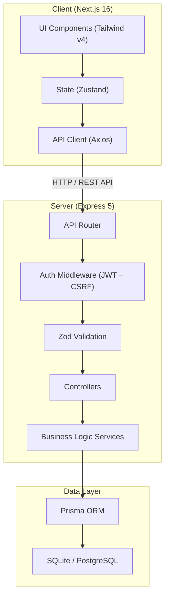
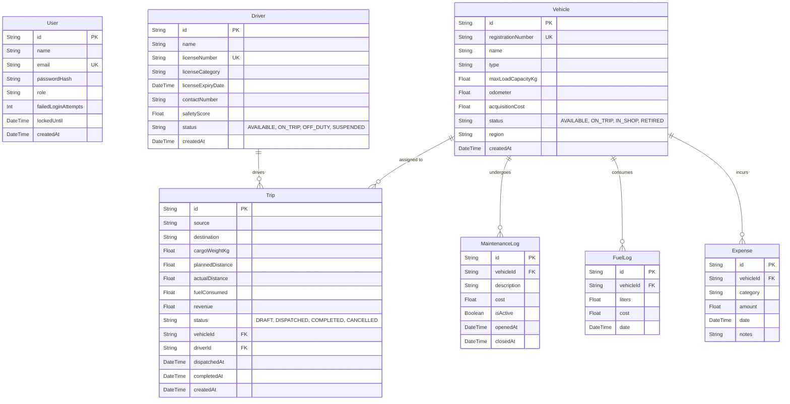

# TransitOPS - Smart Transport Operations Platform

A full-stack, enterprise-grade transport operations platform. This system allows fleet managers to orchestrate dispatches, monitor driver compliance, manage fleet maintenance, and track operational expenses all in real-time.

---

## 🎨 System Design & UI/UX

TransitOPS strictly adheres to an **Industrial Modern** design system to provide a premium, functional, and highly visible interface tailored for dispatch control rooms and fleet managers.

- **Color Palette**: Deep Navy (`#091426`) for sidebars and primary branding, combined with high-visibility Safety Orange (`#fd761a`) for primary calls to action (CTAs). 
- **Typography**: Uses the `Inter` font family exclusively. Features custom font-size scales designed for high data density (`text-data-mono`) and clear typographic hierarchy (`text-headline-lg`).
- **Surface Layering**: Employs distinct `surface` layers (from lowest to highest) to create depth without heavy drop-shadows, using a subtle `micro-shadow` for elevation.
- **Aesthetic Details**: Features a dynamic `AnimatedGridPattern` background across the application, pill-shaped status badges, micro-animations on hover states, and standard Google Material Symbols for iconography.
- **Responsive Layout**: Includes a fixed 260px navigation sidebar (collapsible on mobile) and a sticky top-bar for quick actions.

---

## 🏗 Architecture & Tech Stack



### Backend (Server)
- **Runtime**: Node.js + Express 5
- **Database**: SQLite (via `dev.db` file) / PostgreSQL (supported via Docker).
- **ORM**: Prisma (with heavy use of `$transaction` for atomic operations).
- **Validation**: Zod (strict schema validation at the router level).
- **Security & Auth**: JWT (httpOnly cookie based) and CSRF protection.
- **Logging**: Winston (JSON structured logging in production).
- **Types**: Fully typed with TypeScript.

### Frontend (Client)
- **Framework**: Next.js 16 (App Router)
- **Styling**: Tailwind CSS v4 with custom `class-variance-authority` components.
- **State Management**: Zustand for global authentication state.
- **Data Fetching**: Axios (configured with interceptors for `withCredentials: true` and global 401 handling).
- **Animations**: Framer Motion (powers the background grid pattern).
- **Notifications**: React Hot Toast for non-blocking UI feedback.

### UML Sequence Flow: Trip Dispatch Lifecycle

The following sequence diagram illustrates the end-to-end data flow and atomic transactional constraints when dispatching a new trip:

```mermaid
sequenceDiagram
    actor FM as Fleet Manager
    participant UI as Client (Next.js)
    participant API as Server (Express)
    participant DB as Database (Prisma/SQLite)

    FM->>UI: Submit "New Trip" Form
    UI->>API: POST /api/v1/trips {vehicleId, driverId, ...}
    
    rect rgb(30, 40, 60)
        Note right of API: 1. Validation & Constraint Checks
        API->>DB: Query Vehicle Status
        DB-->>API: Returns Vehicle (AVAILABLE)
        API->>DB: Query Driver Status & License
        DB-->>API: Returns Driver (AVAILABLE & Valid)
    end
    
    alt If any check fails
        API-->>UI: 400 Bad Request (Error Details)
        UI-->>FM: Display Error Toast
    else If all checks pass
        rect rgb(20, 60, 40)
            Note right of API: 2. Atomic Database Transaction
            API->>DB: BEGIN TRANSACTION
            API->>DB: Create Trip (status = DISPATCHED)
            API->>DB: Update Vehicle (status = ON_TRIP)
            API->>DB: Update Driver (status = ON_TRIP)
            API->>DB: COMMIT TRANSACTION
        end
        API-->>UI: 201 Created (Trip Record)
        UI->>UI: Update local Zustand state
        UI-->>FM: Display Success Toast & Render Trip
    end
```



---

## ⚙️ Core Business Logic & State Rules

The application enforces a rigid state machine for fleet operations to prevent real-world conflicts:

1. **Atomic Data**: All state changes to data must be atomic using `prisma.$transaction`.
2. **Maintenance Block**: Vehicles cannot be dispatched if they are in maintenance (`IN_SHOP`).
3. **Weight Limits**: Cargo weight on a trip must not exceed the vehicle's `maxLoadCapacityKg`.
4. **Driver Availability**: Drivers cannot be dispatched if they already have an active trip (`ON_TRIP`).
5. **Safety Compliance**: Drivers cannot be dispatched if their `licenseExpiryDate` has passed.
6. **Dispatch Flow**: Dispatching a trip automatically sets both the associated vehicle and driver to `ON_TRIP`.
7. **Trip Completion**: Completing a trip updates the vehicle's `odometer` by the `actualDistance`, logs fuel usage, and reverts the vehicle/driver to `AVAILABLE`.
8. **Trip Cancellation**: Cancelling a `DISPATCHED` trip safely reverts the vehicle/driver back to `AVAILABLE`.
9. **Service Bay Entry**: Opening a maintenance log immediately pulls the vehicle from the active fleet (`IN_SHOP`).
10. **Service Bay Exit**: Closing a maintenance log returns the vehicle status to `AVAILABLE` (unless it is being `RETIRED`).

---

## 🗄️ Database Schema & Constraints

The application enforces data integrity through the following schema.



---

## 🚀 How to Run

### Option 1: Docker (Recommended)
The easiest way to start the entire stack is using the provided run script which utilizes `docker-compose`:

```bash
# From the root directory:
./run.sh
```
*This will build the client and server images, and start the frontend on port 3000 and backend on port 4000.*

### Option 2: Local Development (Manual Setup)

**1. Database Setup & Seed**
```bash
cd server
npm install
npm run db:reset
```
*This will wipe the SQLite database, run the schema push, and re-seed the initial mock data.*

**2. Start the Backend**
```bash
# In the server/ directory
npm run dev
```
*Server runs on http://localhost:4000.*

**3. Start the Frontend**
```bash
# In the client/ directory
npm install
npm run dev
```
*Client runs on http://localhost:3000.*

---

## 🔑 Demo Credentials

All users share the same password: `Password123!`

**Role-based Test Accounts:**
- `fleetmanager@transitops.com` (Has full mutation and administrative rights)
- `driver@transitops.com` (Limited to dispatching and completing their own assigned trips)
- `safety@transitops.com` (Read-only access focused on compliance)
- `finance@transitops.com` (Read-only access focused on ledger and expenses)
